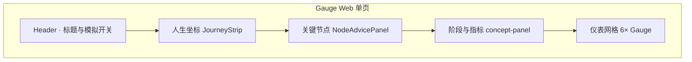
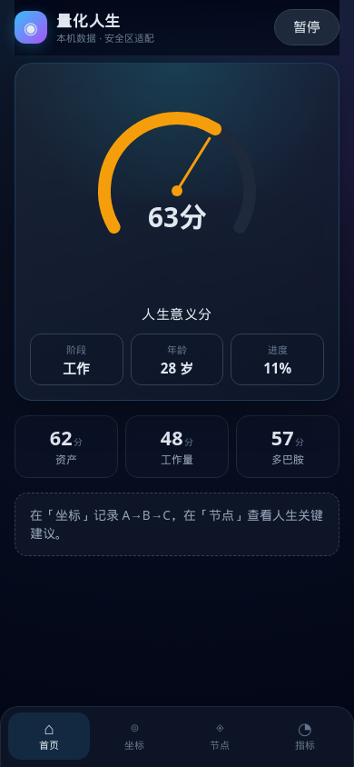
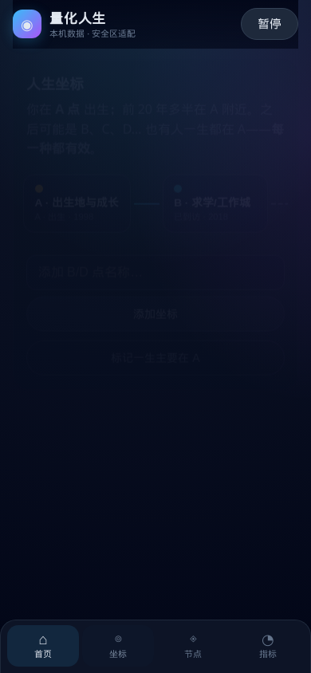
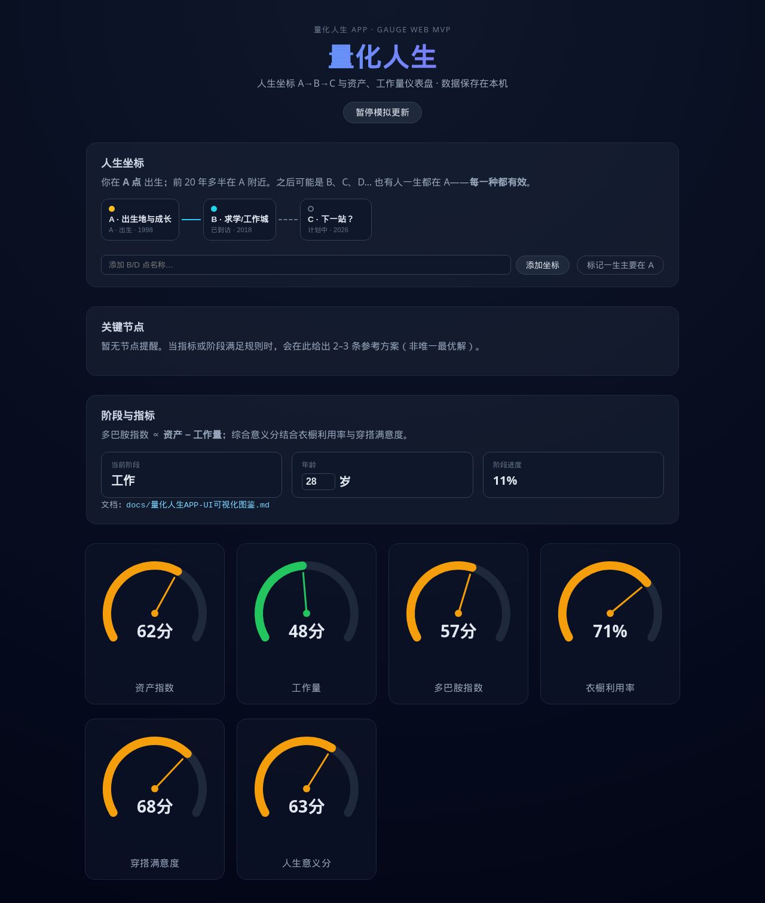
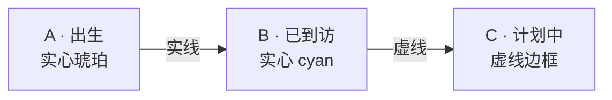
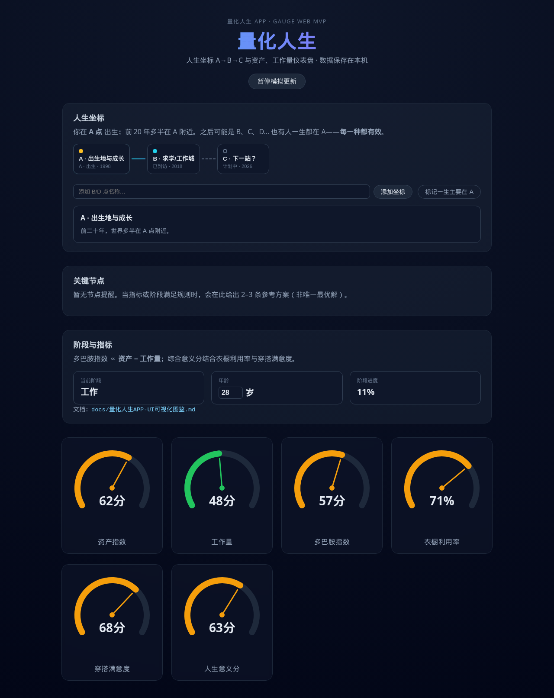
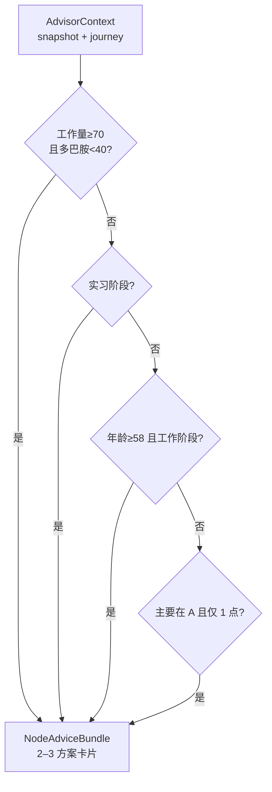
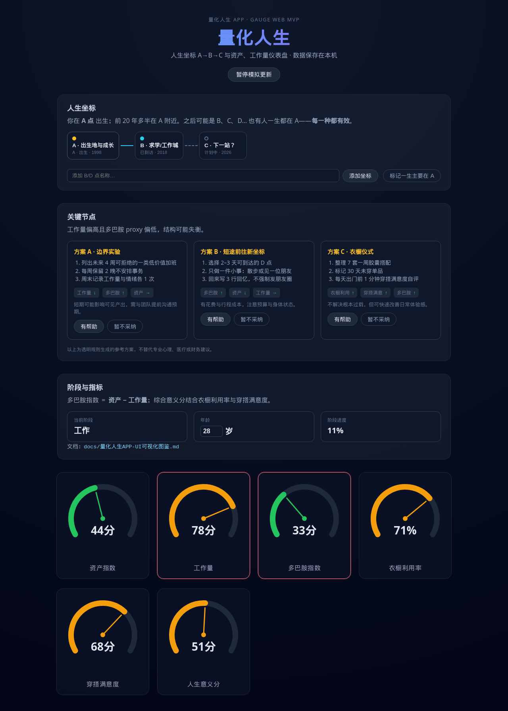
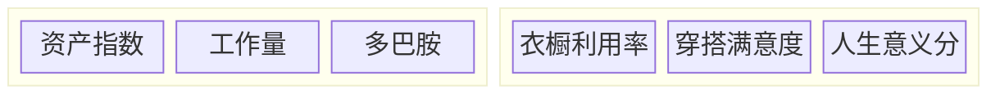

# 量化人生 APP · UI 可视化图鉴

> 版本：v0.1（对应当前 Gauge Web MVP 实现）  
> 关联：[UI 设计文档](./量化人生APP-UI设计文档.md) · [产品文档](./量化人生APP-产品文档.md) · [开发文档](./量化人生APP-开发文档.md)

本文档用 **页面结构图、组件关系图与实机截图** 说明已实现界面，便于产品、设计与开发对齐。

---

## 1. 单页信息架构（已实现）



| 区块 | 组件 | 用户动作 |
|------|------|----------|
| Header | `App.tsx` | 暂停/恢复指标模拟漂移 |
| 人生坐标 | `JourneyStrip` | 点击 A/B/C 点、添加坐标、标记「主要在 A」 |
| 关键节点 | `NodeAdvicePanel` | 查看参考方案、有帮助/暂不采纳 |
| 阶段与指标 | `App.tsx` | 修改年龄（影响阶段与规则） |
| 仪表 | `Gauge` | 只读展示（模拟更新时自动变化） |

---

## 2. 移动 APP 布局（当前默认）

底部 **Tab**：首页 · 坐标 · 节点 · 指标；顶栏 sticky；内容区最大宽度随屏宽（520/640/960）；Toast 与 Tab 栏留出 `safe-area-inset-bottom`。

| 视口 | 截图文件（CI/本地脚本） |
|------|-------------------------|
| 320×568 | `quantified-life-home-mobile-se.png` |
| 390×844 | `quantified-life-home-mobile-md.png` |
| 430×932 | `quantified-life-home-mobile-lg.png` |





---

## 2b. 早期单页纵览（归档）



---

## 3. 人生坐标条带（P-MAP MVP）

### 3.1 交互结构



| Pin 类型 | 视觉 | CSS 类 |
|----------|------|--------|
| birth | 琥珀实心点 | `journey-pin--birth` |
| visited | cyan 实心点 | `journey-pin--visited` |
| planned | 空心灰点 | `journey-pin--planned` |
| 选中 | cyan 外发光 | `journey-pin--selected` |

### 3.2 坐标详情展开

点击 A 点后，下方出现 **坐标详情** 抽屉区块（回忆摘要）。



### 3.3 「一生主要在 A」空状态

当用户标记「主要在 A」且仅保留 birth 点时，显示地球 emoji 空状态（见 UI 设计文档 §4.2），文案不施压。

---

## 4. 关键节点顾问（P-NODES）

### 4.1 触发逻辑（示意）



### 4.2 高负荷场景截图

当 **工作量 78、资产 44** 时，命中 `high-workload-low-dopamine` 规则，展示三列方案卡片；工作量/多巴胺仪表带 **警告描边**（`gauge--warn`）。



### 4.3 方案卡片结构

```
┌─────────────────────────────┐
│ 方案 A · 标题（琥珀）         │
│ 1. 步骤 …                   │
│ 2. 步骤 …                   │
│ [工作量 ↓] [多巴胺 ↑]       │
│ 风险说明                     │
│ [有帮助] [暂不采纳]          │
└─────────────────────────────┘
```

---

## 5. 仪表区布局



- **桌面**：`repeat(auto-fit, minmax(200px, 1fr))` 自适应三列。  
- **窄屏**：意义分可占满一行（见 `index.css` `.gauge-grid .gauge:nth-child(6)`）。

---

## 6. 设计令牌与实现对照

| Token | 值 | 使用位置 |
|-------|-----|----------|
| 面板背景 | `rgba(30,41,59,0.45)` | `.journey-panel`, `.advisor-panel` |
| 卡片底 | `#0f172a` | Pin、方案卡、stage-meta |
| 强调 cyan | `#22d3ee` | 轨迹连线、选中 Pin |
| 强调 amber | `#fbbf24` | 出生 Pin、方案标题 |
| 警告 rose | `#fb7185` | `gauge--warn` |

---

## 7. 数据持久化（UI 相关）

- 键名：`localStorage` → `quantified-life:v1`  
- 保存内容：`inputs`、`journey`、`advisorFeedback`  
- 刷新页面后坐标与年龄保留（可在开发文档 §6 查看 schema）。

---

## 8. 与 APP Tab 导航的映射（未实现，预览）

| Web 单页区块 | 未来 APP Tab |
|--------------|--------------|
| Header + Gauge 网格 | 首页 |
| JourneyStrip | 坐标 |
| NodeAdvicePanel | 节点 |
| （暂无） | 回忆 |
| 年龄/权重（部分） | 我的 |

---

## 9. 截图复现方式

```bash
npm ci
npm run dev
# 另开终端
node scripts/capture-ui.mjs   # 需 playwright（本地一次性依赖）
```

脚本输出与本文 `docs/assets/ui/` 内 PNG 同名，便于回归对比。

---

*图鉴随 UI 变更更新：请同步修改 `scripts/capture-ui.mjs` 并替换 `docs/assets/ui/` 内截图。*
