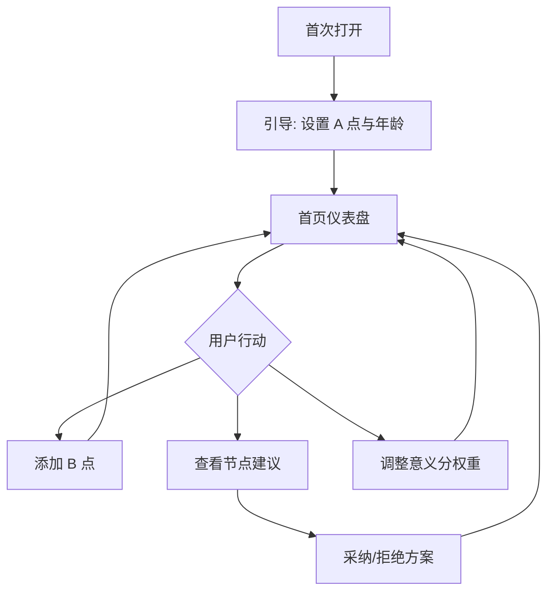

# 量化人生 APP · UI 设计文档

> 版本：v0.1  
> 关联文档：[产品文档](./量化人生APP-产品文档.md) · [开发文档](./量化人生APP-开发文档.md)  
> 设计基准：**Gauge Web**（暗色、仪表、1040px 内容区）— 移动端为伸缩与底栏导航扩展。

---

## 1. 设计原则

1. **地图与仪表并重**：坐标回答「去过哪里、停在何处」；仪表回答「结构是否失衡」。  
2. **节点建议可读可拒**：卡片式方案，明确「参考」而非「命令」。  
3. **暗色低噪**：与现有 `index.css` 一致，突出指针与地图光点。  
4. **可及性**：对比度 WCAG AA；仪表除颜色外有数值与文字标签。  
5. **守根者友好**：空地图（仅 A）使用正向空状态，而非「快去添加足迹」施压。

---

## 2. 设计令牌（Design Tokens）

与 Web 实现对齐，便于 React 共用 CSS 变量（后续可抽 `tokens.css`）。

| Token | 值 | 用途 |
|-------|-----|------|
| `--bg-base` | `#020617` | 页面底 |
| `--bg-elevated` | `#0f172a` | 卡片、仪表底 |
| `--bg-panel` | `rgba(30,41,59,0.45)` | 概念面板 |
| `--border-subtle` | `#1e293b` | 分区边框 |
| `--border-strong` | `#334155` | 输入、meta 卡片 |
| `--text-primary` | `#e2e8f0` | 标题、数值 |
| `--text-secondary` | `#94a3b8` | 正文 |
| `--text-muted` | `#64748b` | Eyebrow、标签 |
| `--accent-cyan` | `#22d3ee` | 地图轨迹、链接 |
| `--accent-amber` | `#fbbf24` | 节点提醒、指针高亮 |
| `--accent-rose` | `#fb7185` | 工作量偏高警告 |
| `--accent-emerald` | `#34d399` | 正向趋势、方案收益 |
| `--radius-lg` | `16px` | 面板 |
| `--radius-md` | `12px` | Meta 块 |
| `--font-sans` | `system-ui, …` | 全局 |
| `--space-page-x` | `1.5rem` | 页边距 |
| `--space-section` | `2rem` | 区块间距 |

### 2.1 字体层级

| 级别 | 大小 | 权重 | 示例 |
|------|------|------|------|
| H1 | 2rem | 700 | 量化人生 |
| H2 | 1.15rem | 600 | 人生坐标 |
| H3 | 1rem | 600 | 方案 A |
| Body | 0.95rem | 400 | 说明段落 |
| Caption | 0.75–0.85rem | 400 | 阶段、单位 |
| Metric | 1.25–1.5rem | 600 | 仪表读数 |

---

## 3. 信息架构与导航

### 3.1 Web（Gauge 当前）

单页滚动：**Header → 概念面板 → 仪表网格**（MVP 扩展：**坐标条带 → 节点卡片**）。

### 3.2 APP（v1 目标）

底部 Tab（5 项）：

| Tab | 图标语义 | 页面 |
|-----|----------|------|
| 首页 | 仪表盘 | 意义分 + 6 仪表摘要 |
| 坐标 | 地图 pin | 人生坐标地图 |
| 节点 | 里程碑 | 关键节点列表与详情 |
| 回忆 | 相册/文字 | 叙事时间线（可选量化） |
| 我的 | 人形 | 权重、隐私、关于 |

---

## 4. 页面线框与规格

### 4.1 首页 · 仪表盘（P-HOME）

**目的**：一眼看到人生意义分与六项指标。

```
┌─────────────────────────────────────┐
│ EYEBROW: cloudWardrobe → Gauge      │
│ H1: 量化人生                         │
│ Sub: 资产、工作量与人生坐标的可视化    │
│ [ 暂停模拟更新 ]                      │
├─────────────────────────────────────┤
│ 概念条：多巴胺 ∝ 资产−工作量          │
│ ┌阶段┐ ┌年龄┐ ┌阶段进度%┐           │
├─────────────────────────────────────┤
│ ┌──────┐ ┌──────┐ ┌──────┐          │
│ │资产  │ │工作量│ │多巴胺│  …        │
│ │ SVG  │ │ SVG  │ │ SVG  │          │
│ │ Gauge│ │ Gauge│ │ Gauge│          │
│ └──────┘ └──────┘ └──────┘          │
│ … 衣橱利用率 / 穿搭满意度 / 意义分    │
└─────────────────────────────────────┘
```

**组件**：

- `Gauge`：label、value、min、max、unit；SVG 弧指针（已实现）。  
- `StageMeta`：dl 三列（当前阶段、年龄、阶段进度）。  
- `LiveToggle`：演示用模拟漂移（产品环境改为「同步数据」）。

**响应式**：

- `≥720px`：仪表 3 列网格。  
- `&lt;720px`：2 列；意义分单独一行全宽（强调）。

---

### 4.2 人生坐标（P-MAP）— MVP 条带 → v1 全屏地图

**叙事 copy（顶栏）**：

> 你在 **A 点** 出生。前 20 年，世界多半在 A 附近。后来你去了 B、C… 也有人一生都在 A。**每一个选择都有效。**

**MVP 条带布局**（Web 扩展区块）：

```
A ●───────● B ─ ─ ● C
   出生      2020   计划？
[ + 添加坐标 ]  [ 编辑 A 点 ]
```

- **A 点**：必填，默认「出生城市」文本；可选 lat/lng。  
- **B/C/D**：圆点 + 标签 + 年份区间；点击打开 **坐标详情抽屉**。  
- **轨迹线**：实线=已到访；虚线=计划中。  
- **空状态**（仅 A）：插画地球 + 文案「一生在 A，也是完整轨迹」。

**v1 全屏地图**：

- 底图：简化暗色地图 tiles 或静态 SVG 世界轮廓。  
- Pin 类型：`birth`（琥珀）、`visited`（ cyan ）、`planned`（空心）。  
- 点击 Pin：**回忆摘要**（140 字内）+ 照片 0–3 张 + 「关联指标快照」（可选）。

**手势（APP）**：双指缩放；长按添加 Pin（需确认，防误触）。

---

### 4.3 关键节点（P-NODES）

**列表项**：

```
┌────────────────────────────────────┐
│ 🔔 工作阶段 · 第 3 年                │
│ 工作量偏高，多巴胺连续偏低           │
│ 2 条参考方案 · 更新于今天            │
└────────────────────────────────────┘
```

**详情页结构**：

1. **情境摘要**：阶段、年龄、A/B 状态、相关指标迷你 sparkline（v1）。  
2. **方案卡片** × 2–3：  
   - 标题（方案 A/B/C）  
   - 行动步骤（≤3 步）  
   - 预期影响（图标 ↑↓→ 作用于 工作量/多巴胺/…）  
   - 风险一行  
   - CTA：`标记有帮助` / `暂不采纳` / `稍后提醒`  
3. **页脚免责**：灰色小字，参考产品文档 §8。

**空状态**：「暂无节点提醒」+ 说明触发条件。

---

### 4.4 指标详情（P-METRIC）— v1

- 单指标大图 Gauge + 30 天趋势（有数据后）。  
- 「为何这项重要」教育 copy。  
- 开关：**在意义分中计入**（权重滑块跳转「我的」）。

---

### 4.5 回忆（P-MEMORY）— v1

- 时间线卡片：日期、地点 Tag、自由文本、照片。  
- **默认不要求打分**；可选「当日穿搭满意度」快捷录入（链 cloudWardrobe）。

---

### 4.6 我的（P-SETTINGS）

| 区块 | 控件 |
|------|------|
| 意义分权重 | 三滑块和为 100%（多巴胺/衣橱/穿搭） |
| 指标可见性 | 多选 Toggle |
| 隐私 | 位置精度、导出、删除全部 |
| 关于 | Goodhart 提示、术语表链接 |

---

## 5. 组件库

| 组件 | 变体 | 状态 |
|------|------|------|
| `Gauge` | sm / md / lg | default, warning (workload&gt;70) |
| `StageMeta` | 3 列 / 紧凑 1 行 | — |
| `LifePointChip` | birth / visited / planned | selected |
| `JourneyStrip` | 仅 Web 横 scroll | — |
| `NodeAdviceCard` | compact / expanded | helpful voted |
| `Button` | primary / ghost / toggle | pressed, disabled |
| `Drawer` | bottom (mobile) / right (web) | — |
| `EmptyState` | map / nodes / memory | — |

### 5.1 Gauge 视觉规范（沿用实现）

- 弧范围：约 270° 开口向下。  
- 指针：圆心旋转，琥珀色。  
- 刻度：min/max 两端 + 当前值居中大字。  
- 警告：工作量仪表 value&gt;70 时 `--accent-rose` 描边。

---

## 6. 关键用户流程



**首次引导（3 步）**：

1. 欢迎 + 产品立场（可量化 / 不可量化）  
2. 设置 A 点与当前年龄  
3. 可选：连接 cloudWardrobe 或跳过  

---

## 7. 文案与语气

- **人称**：第二人称「你」，尊重选择。  
- **禁止**：「你必须」「失败人生」「别人都在 B 点」。  
- **推荐**：「参考」「可能」「根据你当前的…」。  
- **节点标题示例**：「工作量已连续偏高 · 要不要试试边界实验？」

---

## 8. 无障碍（A11y）

- 所有仪表：`aria-label="{label} {value}{unit}"`。  
- 模拟更新按钮：`aria-pressed`。  
- 地图 Pin：可聚焦，Enter 打开详情。  
- 颜色不作为唯一信息载体（方案影响用 ↑↓ 文字）。  
- 支持 `prefers-reduced-motion`：关闭仪表动画与模拟漂移。

---

## 9. Web 与 APP 差异对照

| 能力 | Web Gauge | APP |
|------|-----------|-----|
| 仪表网格 | ✓ | ✓ 首页 |
| 模拟漂移 | 演示 | 关闭或开发者菜单 |
| 地图 | 条带 MVP | 全屏 |
| 节点 | 单卡 MVP | 列表+推送 |
| 回忆 | — | v1 |

---

## 10. 交付物清单（设计 → 开发）

- [ ] Figma / FigJam：地图 Pin 与节点卡（可选，MVP 可线框直达代码）  
- [x] 设计令牌表（本文 §2）  
- [ ] 屏幕截图基准：`/` 首页 dark theme  
- [ ] 组件 Storybook（v1，见开发文档）

---

## 11. MVP 实现映射（当前仓库）

| UI 区块 | 文件 / 组件 | 状态 |
|---------|-------------|------|
| 首页 Header + Toggle | `App.tsx` | 已有 |
| 概念面板 | `App.tsx` | 已有 |
| 仪表网格 | `Gauge.tsx` × 6 | 已有 |
| 坐标条带 | `JourneyStrip.tsx` | 已实现 |
| 节点卡片 | `NodeAdvicePanel.tsx` | 已实现 |
| 可视化图鉴 | [量化人生APP-UI可视化图鉴.md](./量化人生APP-UI可视化图鉴.md) | 实机截图 + Mermaid |

UI 变更时请更新上表并通知产品文档 KPI 是否受影响。

---

*视觉稿以暗色 Gauge 为准；浅色主题列为 v1.1 可选，需重新定义面板对比度。*
